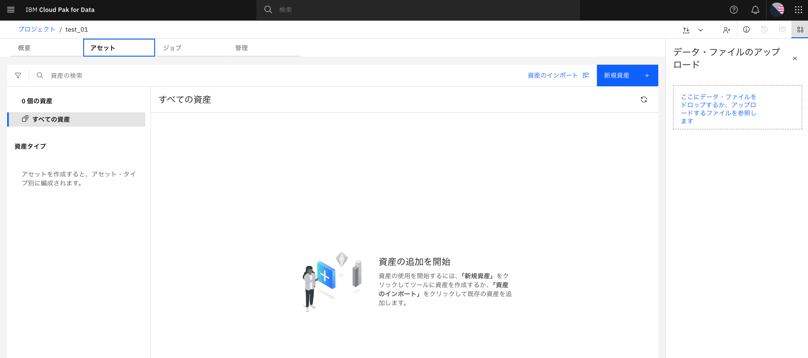
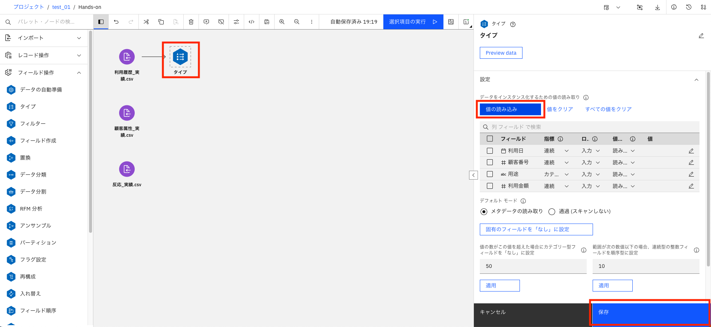
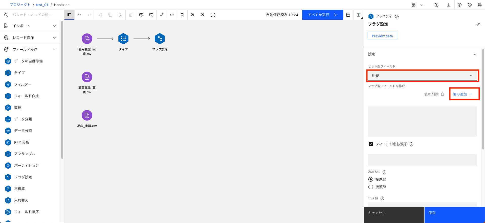
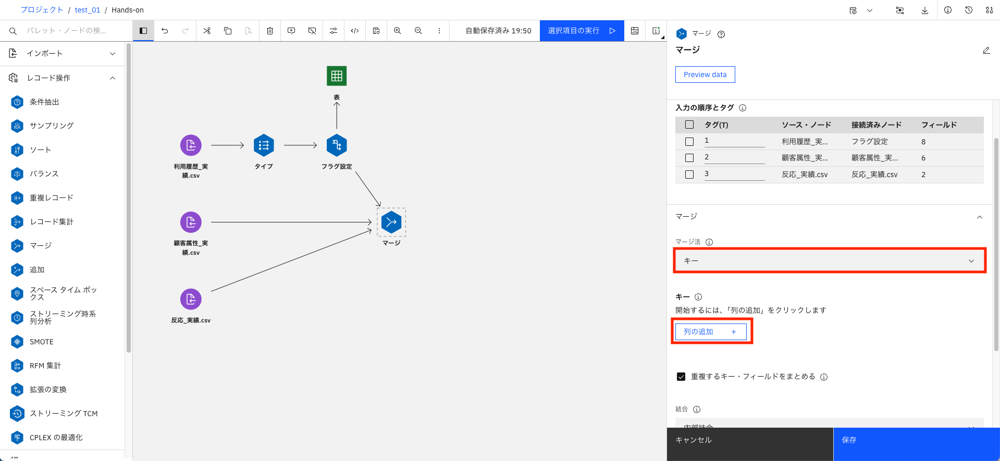
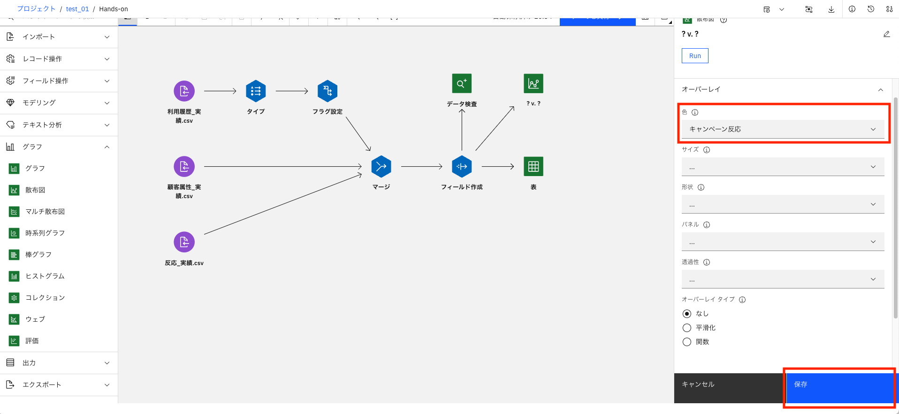
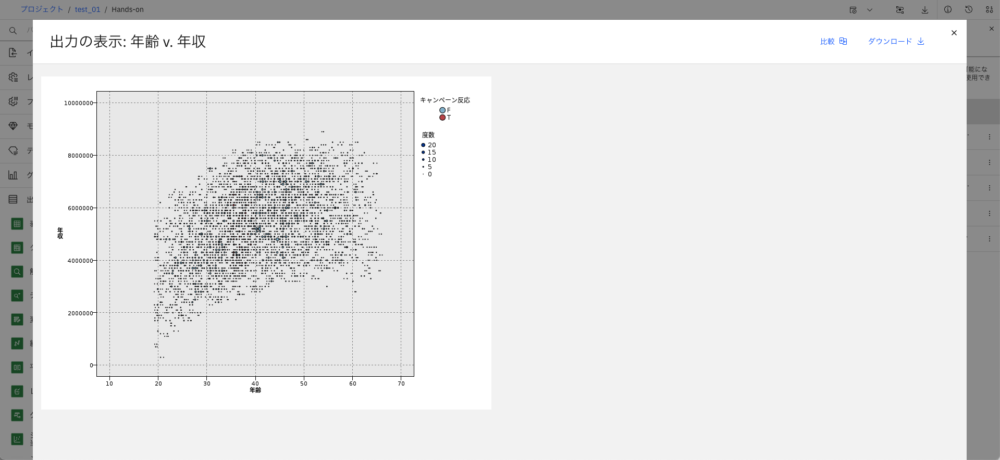
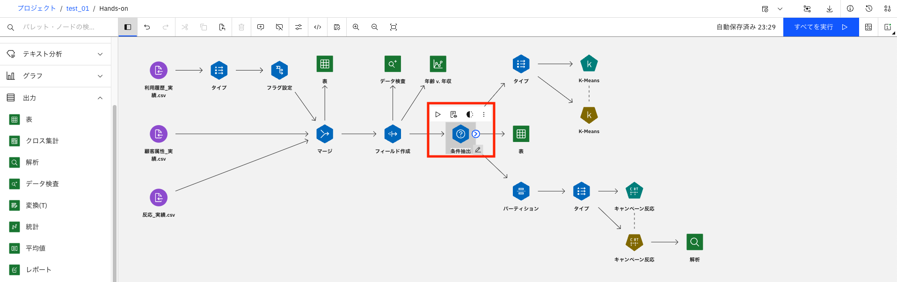

# クレジットカードのキャンペーン反応予測

本ハンズオンでは、クレジットカードの顧客の属性、利用履歴、過去実際にキャンペーンを行った際の反応実績をサンプルデータとして使用し、予測モデルを作成します。
その後、現在の顧客情報を当てはめることで次回キャンペーンを行った場合の反応確度を予測します。
得られる予測結果を元に費用対効果を最大にするターゲットリストを作成します。


本ハンズオンを通じて、1からこのストリーム([完成版ストリームファイル.str](./完成版ストリームファイル.str))を作成していきます。</br>


## 1. プロジェクトへのアクセス

Cloud Pak for Dataのホーム画面で、**すべてのプロジェクト**をクリックします。</br>


プロジェクト画面で、**ml_ご自身の番号**のプロジェクトをクリックします。</br>


以下の様にプロジェクトのホーム画面が表示されたら、プロジェクトのアクセス完了です。</br>


## 2. 資産の作成

**アセットタブ**に切り替えて、**新規資産**をクリックします。</br>


新規資産画面が表示されたら、モデルの処理に表示されている**ビジュアル・フローとしてのモデル作成**をクリックします。</br>


SPSS Modeler Flowの作成画面が表示されたら、任意の名前を設定し**作成**をクリックします。</br>


少し待つと、SPSS Modeler Flowが利用できます。</br>


## 3. データの読み込み

このリポジトリをダウンロードし、[dataフォルダ](./data)に入っている以下のCSVファイルをすべて画面右側の点線で囲まれた部分にアップロードします。</br>
|ファイル名|
|:--|
|顧客属性_実績.csv|
|顧客属性_予測.csv|
|反応_実績.csv|
|利用履歴_実績.csv|
|利用履歴_予測.csv|


アップロードが正常に完了するとこの画面になります。</br>


インポートパレットから、**データ資産**ノードをフロー・キャンバスにドラッグ＆ドロップします。</br>


**データ資産**ノードをダブルクリックします。</br>


データ資産の選択画面が表示されたら、**データアセット** > **利用履歴_実績.csv**を選択し、**選択**をクリックします。</br>


デフォルト設定のまま**保存**をクリックします。</br>


先ほど配置したノードの名前が**利用履歴_実績.csv**に自動で切り替わります。</br>


ノードにカーソルを合わせて、三点リーダーから**データのプレビュー**を選択してみてください。</br>


読み込んだデータの中身を画面上で確認することができます。</br>


同様の手順で、**利用履歴_実績.csv**と**反応_実績.csv**をフロー・キャンバスに追加します。</br>


## 4. データの前処理（エンコーディング）

利用履歴データを顧客毎・用途毎に「使った/使わなかった」のフラグに変換し、縦持ちのデータを横持ちに簡単に変換します。</br>


利用履歴(実績)のデータ型を読み込みます。</br>
フィールド操作パレットから、**タイプ**ノードをフロー・キャンバスにドラッグ＆ドロップし、**利用履歴_実績.csv→タイプ**と接続します。</br>


> **<font color="blue">ノード同士の接続方法</font>**
> 接続元のノードにマウスカーソルを置くと、**＞マーク**が表示されます。
> **＞マーク**をドラッグし接続先のノードの上で離すとノードの接続ができます。
> 

**タイプ**ノードをダブルクリックします。
**値の読み込み**をクリックし、読み込みが完了したら**保存**をクリックします。</br>


フィールド操作パレットから、**フラグ設定**ノードをフロー・キャンバスにドラッグ＆ドロップし、**タイプ→フラグ設定**と接続します。</br>


**フラグ設定**ノードをダブルクリックします。
セット型フィールドは**用途**を選択し、**値の追加**をクリックします。</br>


**全てのチェックボックスをON**にして**OK**をクリックします。</br>


**集計キーをON**にして**列の追加**をクリックします。</br>


**顧客番号をON**にして**OK**をクリックします。</br>


**保存**をクリックします。</br>


データの加工が意図した通りにできているか確認をします。
出力パレットから、**表**ノードをフロー・キャンバスにドラッグ＆ドロップし、**フラグ設定→表**と接続します。</br>


表ノードにカーソルを合わせて、三点リーダーから**実行**をクリックします。
少し待つと、画面右側に出力の実行結果が表示されるので、一番上の出力結果をクリックします。</br>


> 実行結果は、右上にある赤枠のアイコンをクリックし、出力タブに切り替えることで確認できます。
> 

上手く顧客番号毎にどの用途で利用したかを横持ちのテーブルに変換できました。</br>


## 5. データの前処理（レコード結合）

先ほど作成した利用履歴フラグと、顧客属性・反応を顧客番号をキーに1つに結合します。</br>


レコード操作パレットから、**マージ**ノードをフロー・キャンバスにドラッグ＆ドロップし、</br>
**フラグ設定→マージ**
**顧客属性_実績.csv→マージ**
**反応_実績.csv→マージ**</br>
と接続します。</br>


**マージ**ノードをダブルクリックします。
マージ欄のマージ法に**キー**を選択し、**列の追加**をクリックします。</br>


**顧客番号をON**にし、**OK**をクリックします。</br>


**保存**をクリックします。</br>


再度、マージノードによって得られるデータが意図したものか確認するため、一度表ノードに出力します。
ノードを使い回しするため、先ほど使用した**フラグ設定と表の接続を解除**してください。</br>

> **<font color="blue">ノードの接続解除方法</font>**
> 削除したい接続(→)を右クリックし、**削除**をクリックすると接続が解除できます。
> 

接続の解除ができたら、**マージ→表**と接続します。</br>


**表**ノードにカーソルを合わせて、三点リーダーから**実行**をクリックします。
少し待つと、画面右側に出力の実行結果が表示されるので、一番上の出力結果をクリックします。</br>


上手く顧客番号をキーに3つのテーブルを結合できました。</br>


> マージは、キーとなる項目が必要です。
> 各入力データでキーとなる項目名は同じである必要があります。
> キー項目の名称が異なる場合はマージの前に項目名を変更するノード(フィルターノード)を使用します。
> 例）cutomer_number → 顧客番号など

## 6. データの前処理（特徴量抽出）

生データから、予測に役立つ特徴量を抽出します。
生年月日そのものはキャンペーン反応に影響を及ぼさないが、年齢は影響を及ぼすだろう、というデータや業務に対する知識が必要です。
適切なデータを利用して適切な特徴量を設定することが、予測分析の精度を向上するための最も有効な方法です。
今回は、**生年月日から2024年9月25日時点での年齢**を算出します。</br>


フィールド操作パレットから、**フィールド作成**ノードをフロー・キャンバスにドラッグ＆ドロップし、</br>
**マージ→フィールド作成**
**フィールド作成→表**</br>
と接続し直します。</br>
> 既存の接続間にノードを追加したい場合、→の上に追加したいノードをドラッグ＆ドロップすることで簡単に追加することができます。
> 


フィールド作成ノードをダブルクリックし、派生フィールド名に生成する列名として**年齢**と入力します。
式の下にあるアイコンをクリックし、年齢を算出する式を作成します。</br>


式ビルダーが表示されたら、**関数**をクリックします。
**date_years**と入力し、date_years_difference関数を追加します。</br>


関数式に使用する1つ目の項目を選択します。
**フィールド**をクリックし、**生年月日**を追加します。</br>


関数式に使用する2つ目の項目を入力します。
**式のテキストボックス**をクリックし、``?`` を ``'2024-09-25'``に書き換えます。</br>


> 式が下記画像の状態になっていることを確認してください。
> </br>
> 違っていた場合、手入力も可能なので以下の式へ修正してください。
> ```text
> date_years_difference(生年月日,'2024-09-25')
> ```

**保存**をクリックします。</br>


**表**ノードを実行し、出力結果を表示します。
生年月日から、2024年9月25日時点での年齢が算出できました。</br>


> 今回の様な「生年月日から年齢を算出」などの算出処理では主に、**フィールド追加**ノードを利用します。
> 式には、条件分岐などを設定して複雑な計算をすることも可能です。</br>

ここまでで、データの前処理は完了です。

## 7. データ視覚化（データ検査）

集約・結合・特徴量抽出などがひとまず出来た段階でデータの可視化を行い、データ加工が適切か確認します。
出力パレットから、**データ検査**ノードをフロー・キャンバスにドラッグ＆ドロップし、**フィールド作成→データ検査**と接続します。</br>


**データ検査**ノードを実行し、出力結果を表示します。
各項目のグラフ描画・基本的な統計量算出・欠損値の検査を網羅的に行い、想定外の値・分布・欠損値が確認できます。</br>


## 8. データ視覚化（散布図）

次に、複数の項目間の関連を視覚化して確認します。
グラフパレットから、**散布図**ノードをフロー・キャンバスにドラッグ＆ドロップし、**フィールド作成→散布図**と接続します。</br>


**散布図**ノード(ノード名が`?v. ?`になっています)をダブルクリックし、散布図セクションでX軸Y軸に使用する項目を選択します。</br>


オーバーレイセクションで色に**キャンペーン反応**を選択し、**保存**をクリックします。</br>


散布図ノード(ノード名が`年齢v. 年収`になっています)を実行し、出力結果を表示します。</br>


グラフからデータの抽出範囲を検討し、今回のキャンペーンのターゲットを20〜50代・年収200万以上に設定します。</br>


レコード操作パレットから、**条件抽出**ノードを年齢ノードと表ノードの間にドラッグ＆ドロップし、</br>
**年齢→選択**
**選択→表**</br>
と接続し直します。</br>


条件に以下の式を貼り付けて、**保存**をクリックしてください。</br>
```text
'年齢' >= 20 and '年齢' <= 60 and '年収' >= 2000000 and '年収' <= 10000000
```


> 余裕のある方は目的の領域が抽出できていることをグラフで確認してみてください。
> 

## 9. 分類（セグメンテーション）

利用履歴が似ているグループ(クラスター/セグメント)に自動的に分類します。
クラスタリング、クラスター分析とも呼ばれ、顧客セグメント毎の施策立案などに活用されます。
フィールド操作パレットから、**タイプ**ノードをフロー・キャンバスにドラッグ＆ドロップし、**条件抽出→タイプ**と接続します。
**タイプ**ノードをダブルクリックします。</br>


**値の読み込み**をクリックし、ロールを以下の通り設定して**保存**をクリックします。</br>
|フィールド|ロール|
|:-|:-|
|顧客番号|レコードID|
|各用途_|入力|
|上記以外|なし|


モデル作成パレットから、**K-Means**ノードをフロー・キャンバスにドラッグ＆ドロップし、**タイプ→K-Means**と接続します。
K-Meansノードを**実行**します。</br>


K-Meansのモデルナゲットが生成されたら、**モデルの表示**をクリックします。</br>


モデルの詳細が表示されたら、**クラスター**を選択します。
クラスター1は以下の様な特徴を持つことがわかります。</br>

- 旅行代理店は全く使わない
- ETCと宿泊施設はよく使う
- 百貨店はあまり使わない


次に**クラスターの比較**を選択します。
ここでは各用途毎に円の大きさでクラスター間の比較ができます。</br>


## 10. 予測（教師あり学習）

教師あり学習の一種である、CART決定木を用いて予測モデルを作成します。
キャンペーン反応の確度が高いグループと低いグループに分岐していき、最終的に樹木の様に枝分かれした樹形図を作成します。
フィールド操作パレットから、**パーティション**ノードをフロー・キャンバスにドラッグ＆ドロップし、**条件抽出→パーティション**と接続します。</br>


フィールド操作パレットから、**タイプ**ノードをフロー・キャンバスにドラッグ＆ドロップし、**パーティション→タイプ**と接続します。</br>


タイプノードをダブルクリックし、**値の読み込み**をクリックします。
ロールを以下の通り設定して**保存**をクリックします。</br>
|フィールド|ロール|
|:-|:-|
|顧客番号|レコードID|
|生年月日|なし|
|居住地区|なし|
|持ち家|なし|
|キャンペーン反応|対象|
|データ区分|パーティション|
|上記以外|入力|


モデル作成パレットから、**C&R ツリー**ノードをフロー・キャンバスにドラッグ＆ドロップし、**タイプ→C&R ツリー**と接続します。
C&R ツリーノード(ノード名がキャンペーン反応になっています)を**実行**します。</br>


C&R ツリーのモデルナゲットが生成されたら、**モデルの表示**をします。</br>


モデルの詳細が表示されたら、**ツリー図**を選択します。
赤枠で囲った部分は、「航空会社・旅行代理店を使わず、ETC・宿泊施設を使う顧客のキャンペーンの反応確度は56％である」といったルールの集まりになります。</br>


## 11. 学習とテスト

先ほど作成した予測モデルの予測精度を検証します。
パーティションノードによって実績データの一部を学習用に、残りをテスト用に分割して実施します。</br>


出力パレットから、**データ検査**ノードをフロー・キャンバスにドラッグ＆ドロップし、**キャンペーン反応→データ検査**と接続します。</br>


**精度分析**ノードをダブルクリックし、**一致行列**と**評価メトリック**のチェックを**ON**にして、**保存**をクリックします。</br>


**精度分析**ノードを**実行**し、出力結果を表示します。
学習・テストの両方に対して、正答率などを表示できます。
目標としている精度を達成しているかや、過学習（学習データに対しては予測精度が高いのに、テストデータに対しては精度が低いこと）が発生していないかの確認ができます。</br>


## 12. オプション

フロー・キャンバスの処理内容をわかりやすくするため、コメントを追加することができます。
**選択**ノードをダブルクリックして、右上の鉛筆マークをクリックし`年齢20代から50代、年収200万以上で条件抽出`と入力したら、**保存**をクリックします。</br>


こうすることで、フロー・キャンバス上のノード名が入力した内容に変わります。
どの様な条件で抽出を行っているか、一目でわかる様になりました。</br>


フロー・キャンバス上の何もない場所で右クリックをし、**新規コメント**をクリックするとテキストボックスが追加されるので、`学習：実績データから予測モデルを作成`と入力します。フロー・キャンバスのどの部分がどの様な処理を行うかを説明することができます。</br>


以上で学習ステップは完了です。</br>


## 13. 予測ステップ

学習ステップで行ったデータ加工と同じ処理を予測データに対して実施します。
データの読み込みステップと同様の手順で、**利用履歴_予測.csv**と**顧客属性_予測.csv**をフロー・キャンバスに追加します。</br>


学習ステップから、**タイプ**・**フラグ設定**・**マージ**・**年齢**・**選択**ノードをまとめてコピー＆貼り付けをします。</br>


**利用履歴_予測.csv→タイプ**、**顧客属性_予測.csv→マージ**と接続します。</br>


先ほどと同様に学習ステップから、モデルナゲットを全てコピー＆貼り付けをします。</br>


出力パレットから、**表**ノードを3つフロー・キャンバスにドラッグ＆ドロップし、</br>
**生成→各モデルナゲット**
**各モデルナゲット→表**</br>
と接続します。</br>


各表ノードを右クリックし、**実行**をクリックし予測結果を見てみます。</br>


予測結果のフィールドはモデルの手法によって自動で命名・追加されます。
予測結果は画面への表示だけでなく、ファイルやRDBへ書き出すことも可能です。</br>

- 分類（セグメンテーション）の予測結果
  各顧客が分類されるクラスター（グループ）を提示しています。
  

- 予測（教師あり学習）の予測結果
  各顧客がキャンペーンに反応する予測値とその確度を提示しています。
  予測値がTかつ確度が高い顧客から順に、次回キャンペーンのターゲットにすることで、限られたコストで最大限の効果をあげることができます。
  

以上で本ハンズオンは終了です。